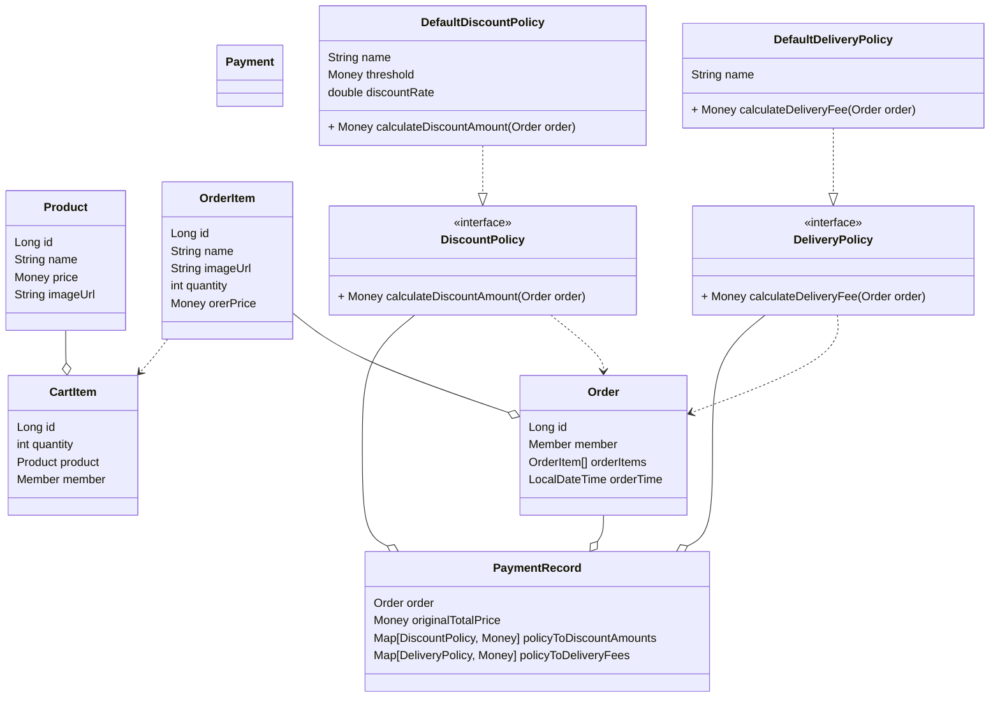

# jwp-shopping-order

# 2단계 기능 목록

- [ ] 장바구니에서 선택한 상품들의 예상 결제 금액을 확인할 수 있다.
- [ ] 장바구니에 담은 상품을 주문할 수 있다.
    - [ ] 최소 1개 이상의 장바구니 상품을 주문할 수 있다.
    - [ ] 주문을 완료한 장바구니 상품은 장바구니에서 삭제된다.
- [ ] 할인 정책을 적용할 수 있다.
    - [x] 할인 정책은 기준 금액과 할인율을 가지고 있다.
        - [ ] 할인율은 100% 이하여야한다.
    - [x] 기준 금액 이상 주문 시 전체 금액에서 할인율만큼 할인된다.
    - [x] 현재 주문에 적용 가능한 할인 정책을 찾을 수 있다.
      ex) 5만원 이상 주문 시 전체 금액에서 10% 할인이 된다.
- [ ] 사용자 별로 주문 목록을 확인할 수 있다.
    - [ ] 최신순으로 주문 목록을 확인할 수 있다.
    - [ ] 주문별로 주문번호, 상품별 정보(이름, 수량, 수량이 반영된 가격, 이미지) 를 확인할 수 있다.
- [ ] 특정 주문의 상세 정보를 확인할 수 있다.
    - [ ] 주문 번호, 상품별 정보와 결제 금액 정보를 확인할 수 있다.
        - [ ] 결제 금액 정보는 주문 금액, 할인 금액, 배송비 정보를 포함한다.

# 클래스 다이어그램

## 추후 고려사항

- 적용될 수 있는 할인 정책이 여러 개인 경우 할인율이 가장 높은 정책을 적용한다.
