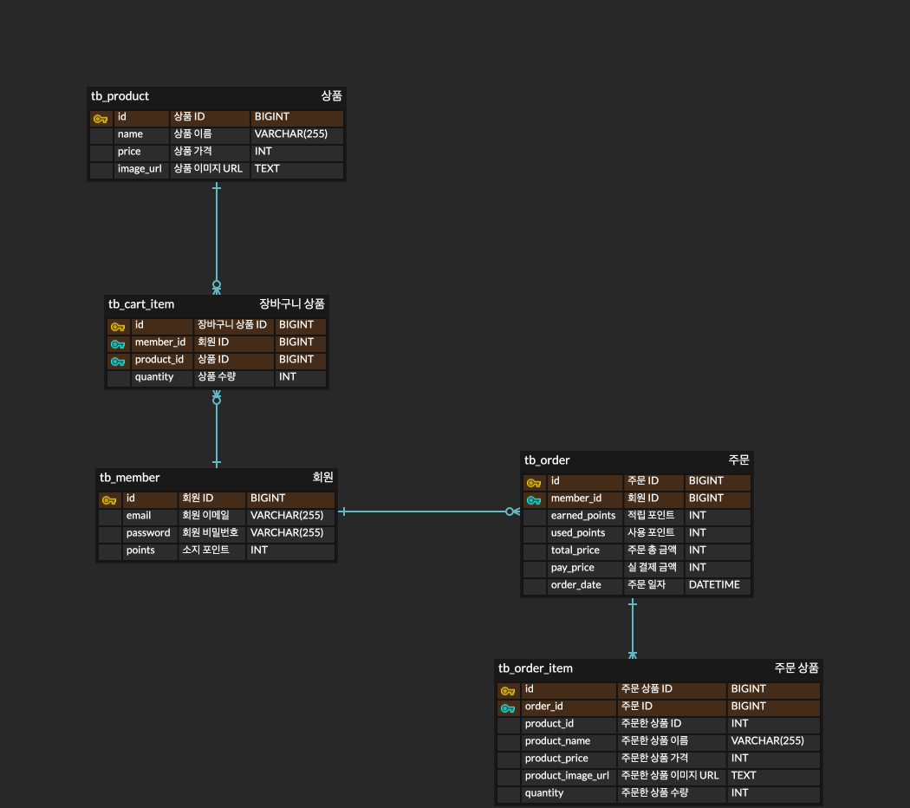

# jwp-shopping-order

## 🎯 기능 요구사항

- [x]  장바구니에 담은 상품을 주문할 수 있다.
    - [x]  장바구니 중 체크된 항목만 주문한다.
        - [x]  아무것도 주문하지 않은 경우(체크 0) 예외가 발생한다.
        - [x]  장바구니에 담기지 않은 상품을 주문할 경우 예외가 발생한다.
    - [x]  주문 시 장바구니에서 주문한 품목을 삭제한다.
- [x]  사용자 별로 주문 목록을 확인할 수 있다.
    - [x]  일정한 개수로 페이징
    - [x]  시간 역순으로 정렬
- [x]  특정 주문의 상세 정보를 확인할 수 있다.
- [x]  포인트 기능을 구현한다.
    - [x]  총 결제 금액의 10%를 포인트로 적립한다.
    - [x]  총 결제 금액의 10%까지 포인트로 결제할 수 있다.
        - [x]  사용자가 가진 포인트를 초과할 경우 예외가 발생한다.
        - [x]  포인트가 음수로 입력될 경우 예외가 발생한다.

## 🛠 설계

### DB

### API

[API 문서️](http://13.125.207.155:8080/docs/docs.html) 에서 확인하실 수 있습니다.
