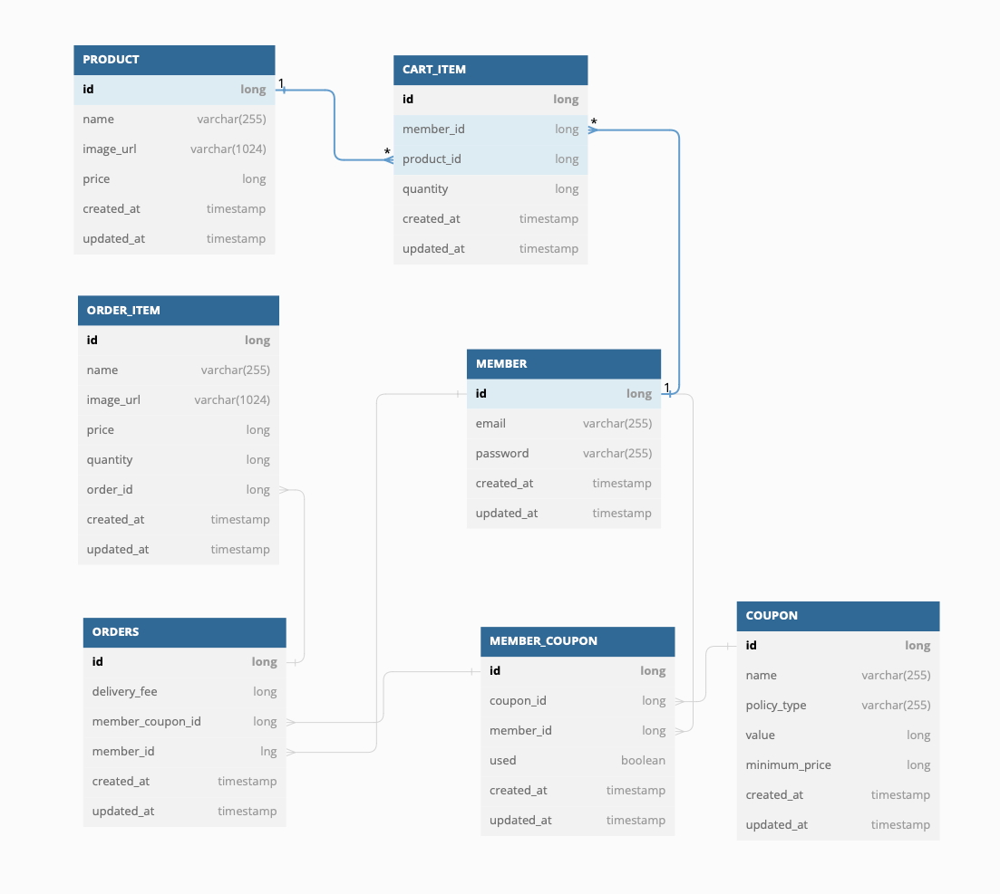

# jwp-shopping-order

## 기능 구현 목록

### 쿠폰

- [x] 사용자가 가지고 있는 쿠폰을 조회할 수 있다.
    - [x] 사용하지 않은 쿠폰만 조회한다.
- [x] 쿠폰을 생성할 수 있다.

### 장바구니

- [x] 장바구니를 추가할 수 있다.
    - [x] 장바구니는 상품 당 하나로 추가할 수 있다.
- [x] 장바구니의 상품 개수를 수정할 수 있다.
- [x] 장바구니 여러 상품을 삭제할 수 있다.
    - [x] 장바구니 상품 개수가 0 이면 삭제한다.

### 주문

- [x] 장바구니 상품 여러개를 주문할 수 있다.
- [x] 사용자 쿠폰을 적용할 수 있다.
    - [x] 장바구니 상품을 주문한 경우, 장바구니에서 삭제된다.
    - [x] 쿠폰을 사용하면 쿠폰 상태를 변경한다.

### DB

