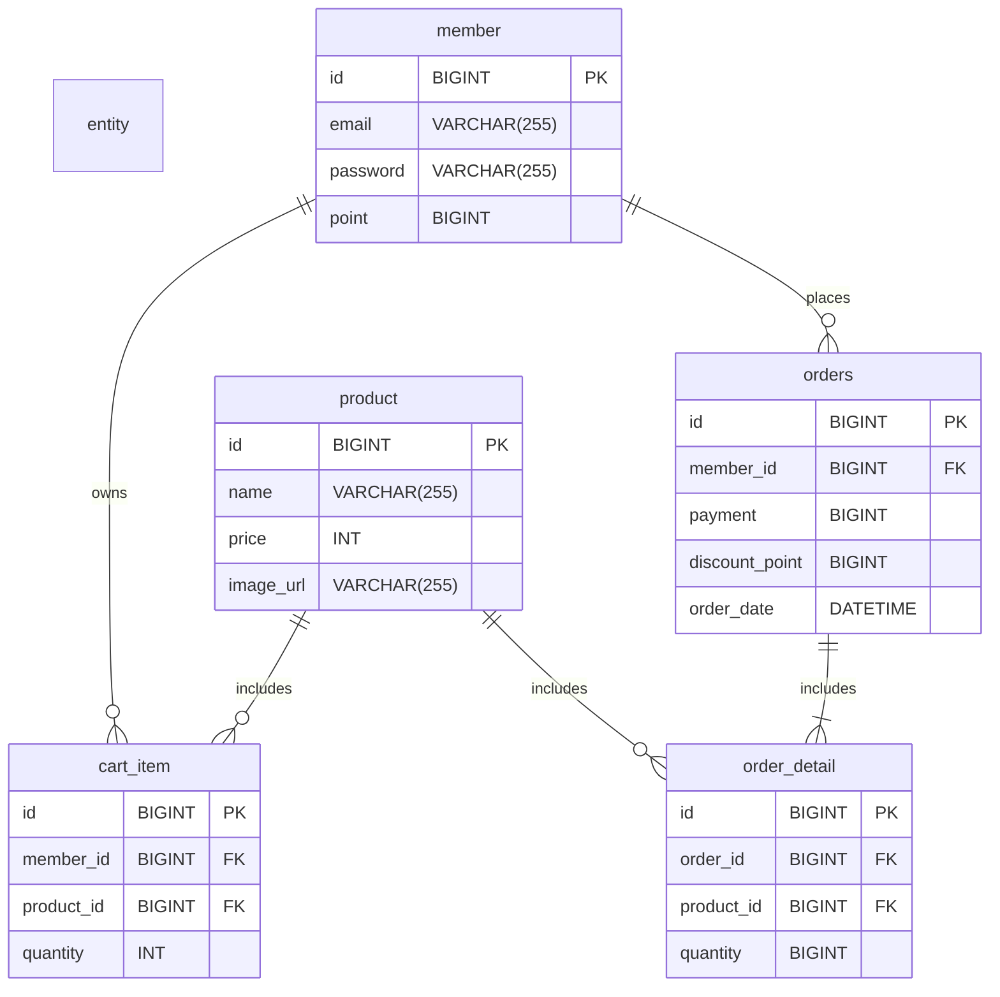

# jwp-shopping-order

# 개발 기능 목록

- [x] 상품 목록 조회
    - [x] 상품 목록을 페이지별로 조회할 수 있다.

- [x] 주문
    - [x] 주문한다.
        - [x] 상품, 포인트, 결제금액 정보로 주문을 요청한다.
            - [x] 상품 검증
                - [x] 존재 여부를 검증한다.
            - [x] 포인트 검증
                - [x] null 혹은 빈 값인지 검증한다.
                - [x] 0 이상인지 검증한다.
                - [x] 포인트를 사용할 수 있는지 검증한다.
            - [x] 결제금액 검증
                - [x] null 혹은 빈 값인지 검증한다.
                - [x] 0 이상인지 검증한다.
            - [x] 가격 검증
                - [x] `총 상품 가격 = 결제금액 + 포인트` 를 만족하는지 검증한다.
        - [x] 사용한 포인트를 차감한다.
        - [x] 결제금액에 해당하는 포인트를 지급한다.
        - [x] 주문한 상품을 장바구니에서 제거한다.
    - [x] 전체 주문을 조회한다.
    - [x] 특정 주문을 조회한다.

- [x] 포인트
    - [x] 포인트를 조회한다
    - [x] 포인트를 차감한다
    - [x] 포인트를 지급한다

# API 명세

## 상품

### 상품 목록 조회(페이지네이션)

Request

```
GET /products?page={int}&size={int} HTTP/1.1
```

Response

```
HTTP/1.1 200 OK
Content-Type: application/json

{
    "pageInfo": {
        "page": 1,
        "size": 10,
        "totalElements": 21,
        "totalPages": 3
    },
    "products": [
        {
            "id": 1,
            "name": "product1",
            "price": 1000,
            "imageUrl": "image.jpeg"
        },
        {
            "id": 2,
            "name": "product2",
            "price": 1000,
            "imageUrl": "image.jpeg"
        },
        (...)
        {
            "id": 10,
            "name": "product10",
            "price": 1000,
            "imageUrl": "image.jpeg"
        }
    ]
}
```

### 상품 조회

Request

```
GET /products/{productId} HTTP/1.1
```

Response

```
HTTP/1.1 200 OK
Content-Type: application/json
{
    "id": 1,
    "name": "치킨",
    "price": 10000,
    "imageUrl": "http://example.com/chicken.jpg"
}
```

### 상품 추가

Request

```
POST /products HTTP/1.1
Content-Type: application/json

{
    "name": "부리또",
    "price": 30000,
    "imageUrl": "http://example.com/burrito.jpg"
}
```

Response

```
HTTP/1.1 201 Created
Location: /products/{productId}
```

### 상품 수정

Request

```
PUT /products/{productId} HTTP/1.1
Content-Type: application/json

{
    "name": "부리또",
    "price": 30000,
    "imageUrl": "http://example.com/burrito.jpg"
}
```

Response

```
HTTP/1.1 200 OK
```

### 상품 삭제

Request

```
DELETE /products/{productId} HTTP/1.1
```

Response

```
HTTP/1.1 204 No Content
```

## 장바구니

### 장바구니 아이템 목록 조회

Request

```
GET /cart-items HTTP/1.1
Authorization: Basic ${credentials}
```

Response

```
HTTP/1.1 200 OK
Content-Type: application/json

[
    {
        "id": 1,
        "quantity": 5,
        "product": {
            "id": 1,
            "price": 10000,
            "name": "치킨",
            "imageUrl": "http://example.com/chicken.jpg"
        }
    },
    {
        "id": 2,
        "quantity": 1,
        "product": {
            "id": 2,
            "price": 20000,
            "name": "피자",
            "imageUrl": "http://example.com/pizza.jpg"
        }
    }
]
```

### 장바구니 아이템 추가

Request

```
POST /cart-items HTTP/1.1
Authorization: Basic ${credentials}
Content-Type: application/json

{
    "productId": 1
}
```

Response

```
HTTP/1.1 201 Created
Location: /cart-items/{cartItemId}
```

### 장바구니 아이템 수량 변경

Request

```
PATCH /cart-items/{cartItemId} HTTP/1.1
Authorization: Basic ${credentials}
Content-Type: application/json

{
    "quantity": 3
}
```

Response

```
HTTP/1.1 200 OK
```

### 장바구니 아이템 삭제

Request

```
DELETE /cart-items/{cartItemId}
Authorization: Basic ${credentials}
```

Response

```
HTTP/1.1 204 No Content
```

## 주문

### 상품 주문

Request

```
POST /orders HTTP/1.1
Authorization: Basic ${credentials}
Content-Type: application/json

{
    "orderItems" : [
        {
            "cartItemId": 1
         },
        {
            "cartItemId" : 2
        }
    ],
    "payment" : {
        "originalPayment" : 5000,
        "finalPayment" : 4000,
        "point" : 1000
    }
}
```

Response

```
HTTP/1.1 201 Created
Location: /orders/{orderId}
Content-Type: application/json
```

### 전체 주문 조회

Request

```
GET /orders?page=1&size=10 HTTP/1.1
Authorization: Basic ${credentials}
Content-Type: application/json
```

Response

```
HTTP/1.1 200 OK
Content-Type: application/json

{
    "pageInfo": {
        "page": 1,
        "size": 10,
        "totalElements": 1,
        "totalPages": 1
    },
    "orders": [
        {
            "orderId": 1,
            "orderedProducts": [
                {
                    "name": "chicken",
                    "price": 20000,
                    "quantity": 1,
                    "imageUrl": "chicken.jpeg"
                }
            ],
            "payment": {
                "originalPayment": 20000,
                "finalPayment": 19000,
                "point": 1000
            }
        }
    ]
}

```

### 특정 주문 조회

Request

```
GET /orders/{orderId} HTTP/1.1
Authorization: Basic ${credentials}
Content-Type: application/json
```

Response

```
HTTP/1.1 200 OK
Content-Type: application/json

{
    "orderId" : 1,
    "orderedProducts" : [
        {
            "name": "치킨",
            "price": 10000,
            "quantity" : 3
            "imageUrl": "http://example.com/chicken.jpg"
        },
        {
            "name": "피자",
            "price": 15000,
            "quantity" : 1
            "imageUrl": "http://example.com/pizza.jpg"
        }
    ],
    "payment" : {
        "originalPayment" : 25000, 
        "finalPayment" : 24000,      
        "point" : 1000
    }
}
```

### 포인트 조회

Request

```
GET /points HTTP/1.1
Authorization: Basic ${credentials}
Content-Type: application/json
```

Response

```
HTTP/1.1 200 OK
Content-Type: application/json

{
  "availablePoint" : 10000
}
```

# DB

## ERD



## DDL

```
CREATE TABLE if not exists product (
    id BIGINT PRIMARY KEY AUTO_INCREMENT,
    name VARCHAR(255) NOT NULL,
    price INT NOT NULL,
    image_url VARCHAR(255) NOT NULL
);

CREATE TABLE if not exists member (
     id BIGINT NOT NULL AUTO_INCREMENT PRIMARY KEY,
     email VARCHAR(255) NOT NULL UNIQUE,
     password VARCHAR(255) NOT NULL,
     point BIGINT NOT NULL
);

CREATE TABLE if not exists cart_item (
    id BIGINT NOT NULL AUTO_INCREMENT PRIMARY KEY,
    member_id BIGINT NOT NULL,
    product_id BIGINT NOT NULL,
    quantity INT NOT NULL,
    FOREIGN KEY (member_id) REFERENCES member(id) ON DELETE CASCADE,
    FOREIGN KEY (product_id) REFERENCES product(id) ON DELETE CASCADE
);

CREATE TABLE if not exists orders (
    id BIGINT NOT NULL AUTO_INCREMENT PRIMARY KEY,
    member_id BIGINT NOT NULL,
    payment BIGINT NOT NULL,
    discount_point BIGINT NOT NULL,
    order_date DATETIME NOT NULL DEFAULT CURRENT_TIMESTAMP,
    FOREIGN KEY (member_id) REFERENCES member(id) ON DELETE CASCADE
);

CREATE TABLE if not exists order_detail (
    id BIGINT NOT NULL AUTO_INCREMENT PRIMARY KEY,
    order_id BIGINT NOT NULL,
    product_id BIGINT NOT NULL,
    quantity BIGINT NOT NULL,
    FOREIGN KEY (order_id) REFERENCES orders(id) ON DELETE CASCADE,
    FOREIGN KEY (product_id) REFERENCES product(id) ON DELETE CASCADE
);
```
