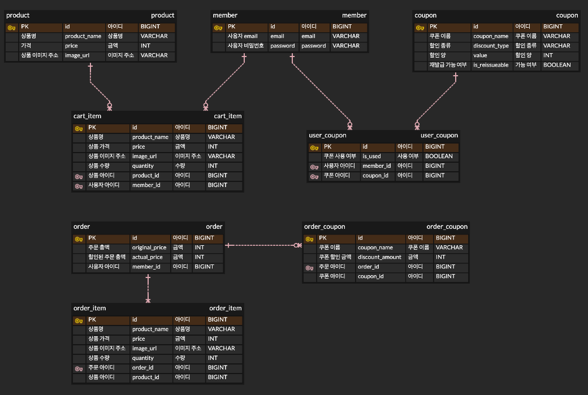

# jwp-shopping-order

## 2단계 기능목록

추가한 재화 : 쿠폰

### API 목록

- [x] 쿠폰을 생성한다
- [x] 전체 쿠폰을 조회한다
- [x] 사용자에게 쿠폰을 발급한다
- [x] 사용자가 보유한 쿠폰을 조회한다
- [x] 장바구니에서 상품을 선택하여 주문한다
- [x] 사용자별 주문 목록 리스트를 조회한다
- [x] 특정 주문의 상세 정보를 조회한다

### 기능 목록

- [x] 상품을 주문한다
  - [x] 총 주문 금액을 계산한다
  - [x] 쿠폰 사용시 쿠폰할인을 고려하여 최종 금액을 계산한다
    - 소수점은 내림한다
    - 정률할인을 복수적용시 순차적용한다
      - 10% + 10%는 20%할인이 아닌, 10%할인 후 다시 10%할인을 한다
    - 정률할인, 정량할인 복수 적용시 정률할인을 먼저 적용한다
  - [x] 주문시 카트의 상품 정보와 최신 상품 정보에 차이가 있으면 예외를 발생시킨다
  - [x] 주문시 요청 수량과 실제 카트 수량에 차이가 있으면 예외를 발생시킨다
  - [x] 주문에 성공하면 카트에서 주문한 상품 정보를 제거한다

- [x] 쿠폰할인을 적용한다
  - 쿠폰은 정률할인, 정량할인이 있지만 정률할인만 우선적으로 구현한다 
  - [x] 정률할인 쿠폰은 금액의 일정 비율을 할인한다
  - [x] 정량할인 쿠폰은 금액의 일정 금액을 할인힌다
    - [x] 주문액보다 큰 금액을 할인하려 하면 주문 금액이 0원이 된다

- [x] 사용자는 쿠폰을 발급받을 수 있다
  - [x] 사용한 쿠폰은 다시 사용할 수 없다
  - 사용자는 사용하지 않은 같은 종류의 쿠폰을 2개 이상 가질 수 없다
  - 사용후에는 쿠폰을 재발급 받을 수 있다

## 명세

### API

[추가된 API 명세](https://dev-pilyang.notion.site/API-8811bf6e59c0468497584e98fb06baad?pvs=4)

### DB

