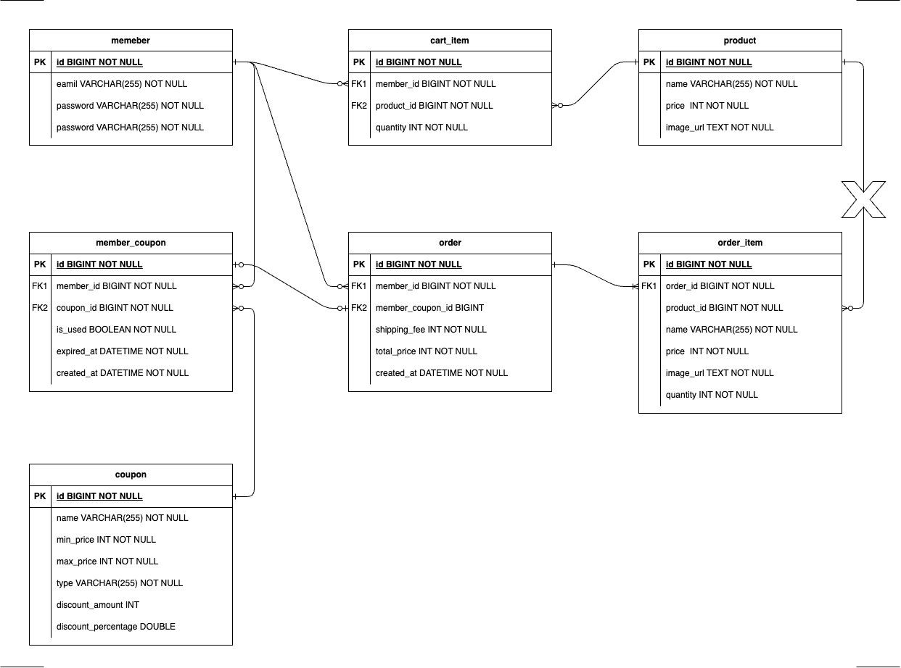

# jwp-shopping-order

# 도메인 기능 목록

## Member
- [x] 회원은 `이메일`, `비밀번호`, `닉네임`을 갖는다.
- [x] 비밀번호를 확인한다.
  - [x] 비밀번호가 틀리면 예외를 발생한다.

##  Product
- [x] 상품은 `이름`, `가격`, `이미지 주소`를 갖는다.
- [x] 상품은 가격 정보를 확인한다.
  - [x] 가격 정보가 변동되었으면 예외를 발생한다.

## CartItems 
- [x] 장바구니 목록은 `장바구니`리스트를 갖는다.
- [x] cartItem 아이디로`장바구니`를 선택한다.
- [x] 주문 가능한 상태인지 확인한다.
- [x] 비어있는 장바구니인지 확인한다.
- [x] 장바구니로 주문을 한다.
- [x] 중복된 상품이이 있는지 확인한다.
- [x] 전체 가격을 계산한다.

## CartItems
- [x] 장바구니는 `수량`, `상품`, `회원`을 갖는다.
- [x] 해당 내역을 주문 상품으로 전환한다.
- [x] 해당 내역의 가격을 계산한다.
- [x] 장바구니 수량 정보를 확인한다.
  - [x] 수량 정보가 변됭었으면 예외를 발생한다.
- [x] 해당 회원이 맞는지 확인한다.
- [x] 수량을 바꾼다.

## Order
- [x] 주문은 `배송비`, `주문 내역`, `회원 쿠폰`, `회원`을 갖는다.
- [x] 주문 생성 시, 배송비를 결정한다.
- [x] 전체 가격을 계산한다.
- [x] 쿠폰으로 할인된 가격을 게산한다.
- [x] 해당 회원이 맞는지 확인한다.
- [x] 주문을 취소한다.

## OrderItem
- [x] 주문 내역은 `상품`, `수량` 을 갖는다.
- [x] 해당 내역의 가격을 계산한다.

## Coupon
- [x] 쿠폰은 `이름`,`최소 주문 금액`,`최대 할인 금액`,`할인율`,`할인액`을 갖는다.
- [x] 쿠폰은 `금액 할인`,`퍼센트 할인`이 있다.
- [x] 사용 가능한 금액인지 판단한다.
- [x] 할인액을 계산한다.

## MemberCoupon
- [x] 회원 쿠폰은 `쿠폰 종류`,`회원`,`만료일`,`생성일`을 갖는다.
- [x] 회원 쿠폰은 `사용전 쿠폰`, `사용후 쿠폰`, `빈 쿠폰`이 있다.
- [x] 쿠폰을 사용처리한다.
- [x] 쿠폰 사용을 취소한다.
- [x] 할인액을 계산한다.
- [x] 만료된 쿠폰인지 확인한다.
- [x] 해당 회원이 맞는지 확인한다.

# 테이블 설계

# API 명세

# Auth 관련

## POST /auth/login

### 상황

> 로그인을 한다.
>

### Request Header

| key | value |
| --- | --- |
| Authorization | Basic ${email:password} |

### Request Body

| Name | Type | Description |
| --- | --- | --- |

```json

```

### Response Header

```bash
HTTP/1.1 200 OK
```

### Response Body

| Name | Type | Description |
| --- | --- | --- |

```json

```

### Error

```json
{
	"errorType": ${ErrorType}
}
```

| ErrorType | Code | Description |
| --- | --- | --- |
| LOGIN_FAIL | 400 | 로그인 실패 |
| INTERNAL_SERVER_ERROR | 500 | 예기치 못한 서버 에러 |

---

# Member 관련

## GET /members/profile

### 상황

> 회원의 정보를 조회한다.
>

### Request Header

| key | value |
| --- | --- |
| Content-Type | application/json |
| Authorization | Basic ${email:password} |

### Request Body

| Name | Type | Description |
| --- | --- | --- |

```json

```

### Response Header

```bash
HTTP/1.1 200 OK
```

| key | value |
| --- | --- |
| Content-Type | application/json |

### Response Body

| Name | Type | Description |
| --- | --- | --- |
| id | Long | 멤버 아이디 |
| email | String | 멤버 이메일 |
| nickname | String | 멤버 닉네임 |

```json
{
	"id":1,
	"email": "test@test.com",
	"nickname": "라잇"
}
```

### Error

```json
{
	"errorType": ${ErrorType}
}
```

| ErrorType | Code | Description |
| --- | --- | --- |
| UNAUTHORIZED | 401 | 로그인이 필요한 서비스일 때 |
| INTERNAL_SERVER_ERROR | 500 | 예기치 못한 서버 에러 |

---

# Product 관련

## GET /products

### 상황

> 전체 상품을 조회한다.
>

### Request Header

| key | value |
| --- | --- |

### Request Body

| Name | Type | Description |
| --- | --- | --- |

```json

```

### Response Header

```bash
HTTP/1.1 200 OK
```

| key | value |
| --- | --- |
| Content-Type | application/json |

### Response Body

| Name | Type | Description |
| --- | --- | --- |
|  | Object[] | 모든 상품 목록 |
| - id | Long | 상품 아이디 |
| - name | String | 상품 이름 |
| - price | int | 상품 가격 |
| - imageUrl | String | 상품 이미지 Url |

```json
[
    {
        "id": 1,
        "name": "치킨",
        "price": 10000,
        "imageUrl": "http://example.com/chicken.jpg"
    },
    {
        "id": 2,
        "name": "피자",
        "price": 20000,
        "imageUrl": "http://example.com/pizza.jpg"
    }
]
```

### Error

```json
{
	"errorType": ${ErrorType}
}
```

| ErrorType | Code | Description |
| --- | --- | --- |
| INTERNAL_SERVER_ERROR | 500 | 예기치 못한 서버 에러 |

## GET /products/{productId}

### 상황

> 특정 상품을 조회한다.
>

### Request Header

| key | value |
| --- | --- |

### Request Body

| Name | Type | Description |
| --- | --- | --- |

```json

```

### Response Header

```bash
HTTP/1.1 200 OK
```

| key | value |
| --- | --- |
| Content-Type | application/json |

### Response Body

| Name | Type | Description |
| --- | --- | --- |
| id | Long | 상품 아이디 |
| name | String | 상품 이름 |
| price | int | 상품 가격 |
| imageUrl | String | 상품 이미지 Url |

```json
{
    "id": 1,
    "name": "치킨",
    "price": 10000,
    "imageUrl": "http://example.com/chicken.jpg"
}
```

### Error

```json
{
	"errorType": ${ErrorType}
}
```

| ErrorType | Code | Description |
| --- | --- | --- |
| PRODUCT_NO_EXIST | 400 | DB에 상품 정보가 없을 때 |
| INTERNAL_SERVER_ERROR | 500 | 예기치 못한 서버 에러 |

## POST /products

### 상황

> 상품의 정보를  추가한다
>

### Request Header

| key | value |
| --- | --- |
| Content-Type | application/json |

### Request Body

| Name | Type | Description |
| --- | --- | --- |
| name | Long | 상품 이름 |
| price | int | 상품 가격 |
| imageUrl | String | 상품 이미지 URL |

```json
{
    "name": "부리또",
    "price": 30000,
    "imageUrl": "http://example.com/burrito.jpg"
}
```

### Response Header

```bash
HTTP/1.1 201 CREATED
```

| key | value |
| --- | --- |
| Location | /products/{productId} |

### Response Body

| Name | Type | Description |
| --- | --- | --- |

```json

```

### Error

```json
{
	"errorType": ${ErrorType}
}
```

| ErrorType | Code | Description |
| --- | --- | --- |
| INVALID_FORM | 400 | JSON 요청 폼이 맞지 않을 때 |
| INTERNAL_SERVER_ERROR | 500 | 예기치 못한 서버 에러 |

## PUT /products/{productId}

### 상황

> 상품의 정보를  수정한다
>

### Request Header

| key | value |
| --- | --- |
| Content-Type | application/json |

### Request Body

| Name | Type | Description |
| --- | --- | --- |
| name | Long | 상품 이름 |
| price | int | 상품 가격 |
| imageUrl | String | 상품 이미지 URL |

```json
{
    "name": "부리또",
    "price": 30000,
    "imageUrl": "http://example.com/burrito.jpg"
}
```

### Response Header

```bash
HTTP/1.1 200 OK
```

| key | value |
| --- | --- |

### Response Body

| Name | Type | Description |
| --- | --- | --- |

```json

```

### Error

```json
{
	"errorType": ${ErrorType}
}
```

| ErrorType | Code | Description |
| --- | --- | --- |
| INVALID_FORM | 400 | JSON 요청 폼이 맞지 않을 때 |
| PRODUCT_NO_EXIST | 400 | DB에 상품 정보가 없을 때 |
| INTERNAL_SERVER_ERROR | 500 | 예기치 못한 서버 에러 |

## DELETE /products/{productId}

### 상황

> 상품의 정보를  삭제한다
>

### Request Header

| key | value |
| --- | --- |
| Content-Type | application/json |

### Request Body

| Name | Type | Description |
| --- | --- | --- |

```json

```

### Response Header

```bash
HTTP/1.1 204 NO CONTENT
```

| key | value |
| --- | --- |

### Response Body

| Name | Type | Description |
| --- | --- | --- |

```json

```

### Error

```json
{
	"errorType": ${ErrorType}
}
```

| ErrorType | Code | Description |
| --- | --- | --- |
| PRODUCT_NO_EXIST | 400 | DB에 상품 정보가 없을 때 |
| INTERNAL_SERVER_ERROR | 500 | 예기치 못한 서버 에러 |

---

# Cart Item 관련

## GET /cart-items

### 상황

> 회원의 장바구니를 조회한다.
>

### Request Header

| key | value |
| --- | --- |
| Authorization | Basic ${email:password} |

### Request Body

| key | value |
| --- | --- |

```json

```

### Response Header

```bash
HTTP/1.1 200 OK
```

| key | value |
| --- | --- |
| Content-Type | application/json |

### Response Body

| Name | Type | Description |
| --- | --- | --- |
|  | Object[] | 회원의 장바구니 목록 |
| - id | Long | 장바구니 아이디 |
| - quantity | int | 장바구니 수량 |
| - product | Object | 상품 정보 |
| - - id | String | 상품 이미지 주소 |
| - - name | String | 상품 이름 |
| - - price | int | 상품 가격 |
| - - imageUrl | String | 상품 이미지 주소 |

```json
[
    {
        "id": 1,
        "quantity": 5,
        "product": {
            "id": 1,
            "price": 10000,
            "name": "치킨",
            "imageUrl": "http://example.com/chicken.jpg"
        }
    },
    {
        "id": 2,
        "quantity": 1,
        "product": {
            "id": 2,
            "price": 20000,
            "name": "피자",
            "imageUrl": "http://example.com/pizza.jpg"
        }
    }
]
```

### Error

```json
{
	"errorType": ${ErrorType}
}
```

| ErrorType | Code | Description |
| --- | --- | --- |
| UNAUTHORIZED | 401 | 로그인 정보가 없을 때 |
| INTERNAL_SERVER_ERROR | 500 | 예기치 못한 서버 에러 |

## POST /cart-items

### 상황

> 회원의 장바구니에 상품을 추가한다
>

### Request Header

| key | value |
| --- | --- |
| Authorization | Basic ${email:password} |
| Content-Type | application/json |

### Request Body

| key | value |
| --- | --- |
| productId | 추가하는 상품의 아이디 |

```json
{
    "productId": 1
}
```

### Response Header

```bash
HTTP/1.1 201 CREATED
```

| key | value |
| --- | --- |
| Location | /cart_items/{cartItemId} |

### Response Body

| Name | Type | Description |
| --- | --- | --- |

```json

```

### Error

```json
{
	"errorType": ${ErrorType}
}
```

| ErrorType | Code | Description |
| --- | --- | --- |
| UNAUTHORIZED | 401 | 로그인 정보가 없을 때 |
| PRODUCT_NO_EXIST | 400 | 상품 정보가 없을 때 |
| CART_ITEM_ALREADY_EXIST | 400 | 이미 장바구니에 존재하는 상품 추가할 때 |
| INVALID_FORM | 400 | JSON 요청 폼이 맞지 않을 때 |
| INTERNAL_SERVER_ERROR | 500 | 예기치 못한 서버 에러 |

## PATCH /cart-items/{cartItemId}

### 상황

> 회원의 장바구니에 수량을 변경한다.
>

### Request Header

| key | value |
| --- | --- |
| Authorization | Basic ${email:password} |
| Content-Type | application/json |

### Request Body

| Name | Type | Description |
| --- | --- | --- |
| quantity | int | 변경하려는 수량 |

```json
{
    "quantity": 1
}
```

### Response Header

```bash
HTTP/1.1 200 OK
```

| key | value |
| --- | --- |

### Response Body

| Name | Type | Description |
| --- | --- | --- |

```json

```

### Error

```json
{
	"errorType": ${ErrorType}
}
```

| ErrorType | Code | Description |
| --- | --- | --- |
| UNAUTHORIZED | 401 | 로그인 정보가 없을 때 |
| FORBIDDEN | 403 | 해당 유저의 권한이 없을 때 |
| CART_ITEM_NO_EXSIT | 400 | 카트 정보가 없을 때 |
| INVALID_FORM | 400 | JSON 요청 폼이 맞지 않을 때 |
| INTERNAL_SERVER_ERROR | 500 | 예기치 못한 서버 에러 |

## DELETE /cart-items/{cartItemId}

### 상황

> 회원의 장바구니 삭제한다.
>

### Request Header

| key | value |
| --- | --- |
| Authorization | Basic ${email:password} |

### Request Body

| Name | Type | Description |
| --- | --- | --- |

```json

```

### Response Header

```bash
HTTP/1.1 204 NO CONTENT
```

| key | value |
| --- | --- |

### Response Body

| Name | Type | Description |
| --- | --- | --- |

```json

```

### Error

```json
{
	"errorType": ${ErrorType}
}
```

| ErrorType | Code | Description |
| --- | --- | --- |
| UNAUTHORIZED | 401 | 로그인 정보가 없을 때 |
| FORBIDDEN | 403 | 해당 유저의 권한이 없을 때 |
| CART_ITEM_NO_EXSIT | 400 | 카트 정보가 없을 때 |
| INVALID_FORM | 400 | JSON 요청 폼이 맞지 않을 때 |
| INTERNAL_SERVER_ERROR | 500 | 예기치 못한 서버 에러 |

---

# Order 관련

## GET /orders

### 상황

> 회원의 모든 주문 내역을 조회한다.
>

### Request Header

| key | value |
| --- | --- |
| Authorization | Basic ${email:password} |

### Request Body

| Name | Type | Description |
| --- | --- | --- |

```json

```

### Response Header

```bash
HTTP/1.1 200 OK
```

| key | value |
| --- | --- |
| Content-Type | application/json |

### Response Body

| Name | Type | Description |
| --- | --- | --- |
| orders | Object[] | 주문 객체 리스트 |
| - id | Int | 주문 아이디 |
| - products | Object[] | 주문한 상품 객체 리스트 (주문 당시의 정보) |
| - - id | Int | 상품 아이디 |
| - - name | String | 상품 이름 |
| - - price | Int | 상품 가격 |
| - - imageUrl | String | 상품 이미지 주소 |
| - - quantity | Int | 주문 수량 |

```json
{
	"orders": [
		{
			"id": 1,
			"products": [
				{
					"id": 1,
					"name": "121123",
					"imageUrl": "https://adfadf",
					"price": 10000,
					"quantity": 3
				}, 
				{
					"id": 1,
					"name": "121123",
					"price": "https://adfadf",
					"price": 10000,
					"quantity": 3
				}
			]
		}
	]
}
```

### Error

```json
{
	"errorType": ${ErrorType}
}
```

| ErrorType | Code | Description |
| --- | --- | --- |
| UNAUTHORIZED | 401 | 로그인 정보가 없을 때 |
| INTERNAL_SERVER_ERROR | 500 | 예기치 못한 서버 에러 |

## GET /orders/{orderId}

### 상황

> 회원의 주문을 조회한다.
>

### Request Header

| key | value |
| --- | --- |
| Authorization | Basic ${email:password} |

### Request Body

| Name | Type | Description |
| --- | --- | --- |

```json

```

### Response Header

```bash
HTTP/1.1 200 OK
```

| key | value |
| --- | --- |
| Content-Type | application/json |

### Response Body

| Name | Type | Description                         |
| --- | --- |-------------------------------------|
| id | Int | 주문 아이디                              |
| products | Object[] | 주문한 상품 객체 리스트 (주문 당시 정보)            |
| - id | Int | 상품 아이디                              |
| - name | String | 상품 이름                               |
| - price | Int | 상품 가격                               |
| - imageUrl | String | 상품 이미지 주소                           |
| - quantity | Int | 주문 수량                               |
| totalProductPrice | Int | 모든 상품의 가격 합 (sum of price*quantity) |
| discountPrice | Int | 할인 금액                               |
| shippingFee | Int | 배송비                                 |

```json
{
	"id":1,
	"products": [
				{
					"id": 1,
					"name": "121123",
					"imageUrl": "https://adfadf",
					"price": 1000,
					"quantity": 3
				}, 
				{
					"id": 1,
					"name": "121123",
					"imageUrl": "https://adfadf",
					"price": 1000,
					"quantity": 3
				}
			],
	"totalProductPrice": 10000,
	"discountPrice": 2000,
	"shippingFee": 3000
}
```

### Error

```json
{
	"errorType": ${ErrorType}
}
```

| ErrorType | Code | Description |
| --- | --- | --- |
| UNAUTHORIZED | 401 | 로그인 정보가 없을 때 |
| FORBIDDEN | 403 | 해당 유저의 권한이 없을 때 |
| ORDER_NO_EXIST | 400 | 주문이 존재하지 않을 때 |
| INTERNAL_SERVER_ERROR | 500 | 예기치 못한 서버 에러 |

## POST /orders

### 상황

> 회원의 장바구니 목록을 통하여 주문한다.
>

### Request Header

| key | value |
| --- | --- |
| Authorization | Basic ${email:password} |
| Content-Type | application/json |

### Request Body

| Name | Type | Description                             |
| --- | --- |-----------------------------------------|
| couponId | Int | 쿠폰 아이디                                  
(사용하는 쿠폰이 없을 시 null) |
| products | Object[] | 장바구니에 담은 상품 리스트                         |
| - | Object | 주문 결제 창에서 보여지는 정보 (주문 시도를 하는 상품, 수량 정보) |
| -- cartItemId | Int | 장바구니 아이디                                |
| - - quantity | Int | 수량                                      |
| - - name | String | 상품 이름                                   |
| - - price | Int | 상품 가격                                   |
| - - imageUrl | String | 상품 이미지 주소                               |

```json
{
	"couponId": 10,
	"products": [
		{
			"cartItemId": 1,
			"quantity": 5,
			"name": "피자",
			"price": 20000,
			"imageUrl": "https://...."
		}
	]
}
```

### Response Header

```bash
HTTP/1.1 201 CREATED
```

| key | value |
| --- | --- |
| Content-Type | application/json |

### Response Body

| Name | Type | Description |
| --- | --- | --- |

```json

```

### Error

```json
{
	"errorType": ${ErrorType}
}
```

| ErrorType | Code | Description                       |
| --- | --- |-----------------------------------|
| UNAUTHORIZED | 401 | 로그인 정보가 없을 때                      |
| FORBIDDEN | 403 | 해당 유저의 권한이 없을 때                   (쿠폰, 장바구니) |
| CART_ITEM_EMPTY | 400 | 선택한 장바구니 목록이 없을 때                 |
| CART_ITEM_NO_EXSIT | 400 | DB에  장바구니 정보가 없을 때                |
| PRODUCT_NO_EXIST | 400 | DB에 상품 정보가 없을 때                   |
| COUPON_NO_EXIST | 400 | DB에 쿠폰 정보가 없을 때                   |
| COUPON_UNAVAILABLE | 400 | 사용 불가능한 쿠폰(유효기간, 최소 주문 금액, 사용된)   |
| CART_ITEM_QUANTITY_INCORRECT | 400 | 현재 DB의 장바구니 수량이 요청의 정보와 일치하지 않을 때 |
| CART_ITEM_PRICE_INCORRECT | 400 | 현재 DB의 장바구니 가격이 요청의 정보와 일치하지 않을 때 |
| INVALID_FORM | 400 | JSON 요청 폼이 맞지 않을 때                |
| INTERNAL_SERVER_ERROR | 500 | 예기치 못한 서버 에러                      |

## DELETE /orders/{orderId}

### 상황

> 주문을 취소한다.
>

### Request Header

| key | value |
| --- | --- |

### Request Body

| Name | Type | Description |
| --- | --- | --- |

```json

```

### Response Header

```bash
HTTP/1.1 204 NO CONTENT
```

| key | value |
| --- | --- |
| Content-Type | application/json |

### Response Body

| Name | Type | Description |
| --- | --- | --- |

```json

```

### Error

```json
{
	"errorType": ${ErrorType}
}
```

| ErrorType | Code | Description |
| --- | --- | --- |
| UNAUTHORIZED | 401 | 로그인 정보가 없을 때 |
| FORBIDDEN | 403 | 해당 유저의 권한이 없을 때(쿠폰, 장바구니) |
| ORDER_NO_EXIST | 400 | DB에 주문 정보가 없을 때 |
| INTERNAL_SERVER_ERROR | 500 | 예기치 못한 서버 에러 |

---

# Coupon 관련

## GET /orders/coupons?cartItemId=1&cartItemId=2&…

### 상황

> 선택한 장바구니에 대하여 회원의 쿠폰 내역을 조회한다.
>

### Request Header

| key | value |
| --- | --- |
| Authorization | Basic ${email:password} |

### Request Body

| key | value |
| --- | --- |

```json

```

### Response Header

```bash
HTTP/1.1 200 OK
```

| key | value |
| --- | --- |
| Content-Type | application/json |

### Response Body

| Name | Type | Description |
| --- | --- | --- |
| coupons | Object[] | 쿠폰 객체 리스트 |
| - id | Int | 쿠폰 아이디 |
| - name | String | 쿠폰 이름 |
| - minOrderPrice | Int | 최소 적용 금액(ex. 30000원 이상 적용 가능) |
| - maxDiscountPrice | Int | 최대 할인 금액(ex. 최대 3000원 할인) |
| - isAvailable | Boolean | 쿠폰 적용 가능 여부(상품 금액이 최소 적용 금액 이상일 경우) |
| - discountPrice | Int | 할인 금액(ex. 10000원에서 10%할인 → 1000원/1000원 할인 쿠폰 → 1000원)

적용 불가능할 경우, null |
| - expiredAt | LocalDateTime | 쿠폰 만료기한
“yyyy-MM-ddTHH:mm:ss” |

```json
{
	"coupons": [
		{
			"id": 1,
			"name": "반짝할인(10%)",
			"minOrderPrice": 10000,
			"maxDiscountPrice": 5000,
			"isAvailable": true,
			"discountPrice": 3000,
			"expiredAt": "2023-05-31T14:30:45"
		},
		{
			"id": 3,
			"name": "반짝할인(20%)",
			"minOrderPrice": 20000,
			"maxDiscountPrice": 5000,
			"isAvailable": false,
			"discountPrice": null,
			"expiredAt": "2023-05-31T14:30:45"
		}
	]
}
```

### Error

```json
{
	"errorType": ${ErrorType}
}
```

| ErrorType | Code | Description |
| --- | --- | --- |
| UNAUTHORIZED | 401 | 로그인 정보가 없을 때 |
| FORBIDDEN | 403 | 해당 유저의 권한이 없을 때 (장바구니) |
| CART_ITEM_NO_EXIST | 400 | DB에 장바구니 정보가 없을 때 |
| INTERNAL_SERVER_ERROR | 500 | 예기치 못한 서버 에러 |

## GET /coupons

### 상황

> 발급 가능한 쿠폰 리스트를 조회한다
>

### Request Header

| key | value |
| --- | --- |

### Request Body

| key | value |
| --- | --- |

```json

```

### Response Header

```bash
HTTP/1.1 200 OK
```

| key | value |
| --- | --- |
| Content-Type | application/json |

### Response Body

| Name | Type | Description |
| --- | --- | --- |
| coupons | Object[] |  |
| - id | Intger | 쿠폰 id |
| - name | String | 쿠폰 이름 |
| - minOrderPrice | Integer | 멤버 nickname |
| - maxDiscountPrice | Integer | 최대 할인 금액 - NULLABLE |
| - type | String | FIXED_AMOUNT / FIXED_PERCENTAGE |
| - discountAmount | Integer | 할인 금액 (1000) - NULLABLE |
| - discountPercentage | Double | 할인 비율 (0.5) - NULLABLE |

```json
{
	"coupons": [
		{
			"id": 1,
			"name": "1000원 할인 쿠폰",
			"minOrderPrice": 10000,
			"maxDiscountPrice": null,
			"type": "FIXED_AMOUNT",
			"discountAmount": 1000,
			"discountPercentage": null
		},
		{
			"id": 1,
			"name": "20% 할인 쿠폰",
			"minOrderPrice": 10000,
			"maxDiscountPrice": 5000,
			"type": "FIXED_PERCENTAGE",
			"discountAmount": null,
			"discountPercentage": 0.2
		}
	]
}
```

### Error

```json
{
	"errorType": ${ErrorType}
}
```

| ErrorType | Code | Description |
| --- | --- | --- |
| INTERNAL_SERVER_ERROR | 500 | 예기치 못한 서버 에러 |

## POST /coupons/{couponId}

### 상황

> 회원이 쿠폰을 발급한다
>

### Request Header

| key | value |
| --- | --- |
| Authorization | Basic ${email:password} |
| Content-Type | application/json |

### Request Body

| Name | Type | Description |
| --- | --- | --- |
| expiredAt | LocalDateTime | 쿠폰 만료기한“yyyy-MM-ddTHH:mm:ss” |

```json
{
	"expiredAt": "2023-05-31T14:30:45"
}
```

### Response Header

```bash
HTTP/1.1 201 CREATED
```

| key | value |
| --- | --- |

### Response Body

| Name | Type | Description |
| --- | --- | --- |

```json

```

### Error

```json
{
	"errorType": ${ErrorType}
}
```

| ErrorType | Code | Description |
| --- | --- | --- |
| UNAUTHORIZED | 401 | 로그인 정보가 없을 때 |
| COUPON_NO_EXIST | 400 | DB에 쿠폰 정보가 없을 때 |
| INVALID_FORM | 400 | JSON 요청 폼이 맞지 않을 때 |
| INTERNAL_SERVER_ERROR | 500 | 예기치 못한 서버 에러 |
