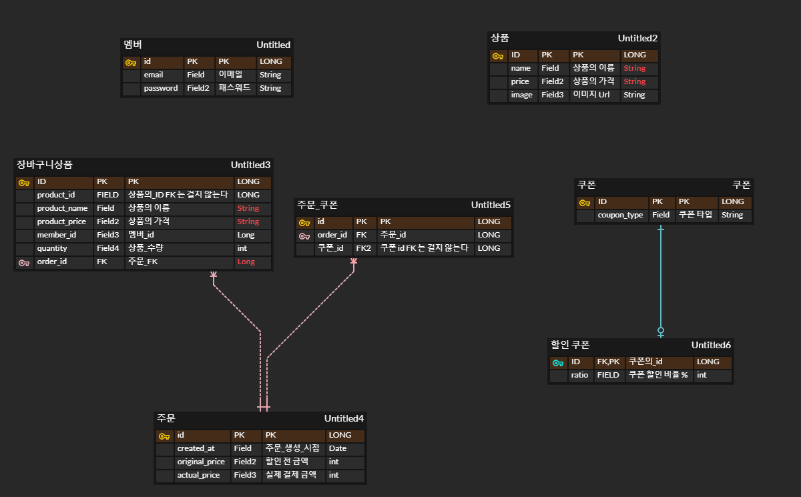
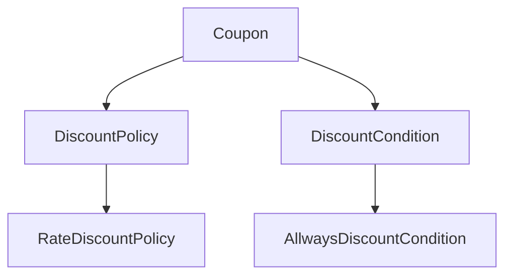

# 2단계 기능 목록 작성

- [x] swagger 적용

- [x] 테이블 설계
- [x] 기존 cart 에 어울리지 않는 기능들 도메인별로 분리

- [x] 도메인 설계
    - [x] 회원
    - [x] 상품
    - [x] 쿠폰
    - [x] 장바구니
- API 설계
    - 쿠폰
        - [x] 모든 쿠폰을 조회할 수 있다
        - [x] 멤버가 가지고 있는 쿠폰을 조회할 수 있다
        - [x] 멤버가 쿠폰을 발급 받을 수 있다
    - 주문
        - [x] 사용자는 장바구니에 담긴 상품을 주문할 수 있다
        - [x] 사용자는 주문 내역을 조회할 수 있다
        - [x] 특정 주문의 상세 정보를 조회할 수 있다

# 테이블 설계



## 주문

주문 테이블에서 상품을 직접 PK 로 참조하지 않는 이유는 도메인별로 특징에 맞는 db 를 사용할 수 있다는 가정을 가지고 진행했습니다

주문이라는 서비스가 나중에 다른 프로젝트로 분리되면, 주문 테이블에서 상품을 직접 참조하는 것은 불필요한 의존성을 만들게 됩니다

장바구니 상품에서 그냥 ID 만을 참조하지 않는 이유는, 장바구니에 담긴 상품이 삭제되더라도 주문 내역에는 남아있어야 하기 때문입니다

장바구니 상품이 변경되면, 장바구니에는 영향을 주지 않고, 주문시, 예외를 발생시키기 위해서 입니다

예시) 짜장면 3000원을 담았는데, 짬뽕 5000원으로 변경된 경우, 주문 내역이 짬뽕으로 변경되면 이상하다고 생각했습니다

# 도메인 설계

## 쿠폰

쿠폰은 할인 쿠폰이 있습니다(현재는 비율 할인 하나지만, 나중에 다른 종류가 추가될 수 있습니다)
쿠폰은 할인 조건이 있습니다(현재는 전체 상품이지만, 나중에 다른 조건이 추가될 수 있습니다)

할인 쿠폰은 할인 비율을 가지고 있습니다



할인된 금액을 계산해주는 것이 가장 중요한 역할을 합니다

쿠폰 타입은 입력을 받을때, enum 이 아니라, String 형태로 받고 있습니다  
enum 을 사용하는 경우에는, 변경이 적은 경우에만 사용하는 것으로 알고 있지만, 도메인상 자주 변할 것 같아서 String 형태로 주었습니다

## member

1단계의 회원 도메인과 크게 달라지지 않습니다

## product

1단계의 상품 도메인과 크게 달라지지 않습니다

## cart

주문을 하게 되면, 장바구니에 담긴 상품이 주문 내역으로 이동하게 됩니다

상품이 변경되어도, 장바구니에는 영향을 주지 않습니다

주문시 상품이 변경되었다면, 장바구니의 상품이 취소됩니다

### 주문 flow

1. 장바구니에 담긴 상품을 주문합니다
2. 주문을 한 멤버가 존재하는지 검사합니다
3. 쿠폰이 있다면 쿠폰의 유효성 검사를 합니다
4. 총 금액을 계산합니다
5. 쿠폰이 있다면, 쿠폰을 적용합니다
6. 주문 내역을 생성합니다
7. 주문 내역을 저장합니다

### 도메인 객체

- ProductVerifier(인터페이스)
    - List 의 상품 정보를 받아서, 최신 상품과 비교한다
        - [ ] 상품이 변경되었다면, 예외를 발생시킨다
- Coupon(인터페이스)
    - 쿠폰을 받아서
        - [ ] 있는지 체크한다
        - [ ] 할인된 금액을 반환한다
- Order
    - [ ] 주문 내역을 생성한다
- OrderRepository(인터페이스)
    - [ ] 주문 내역을 저장한다
    - [ ] 특정 주문 내역을 조회한다
    - [ ] 사용자별로 주문 내역을 조회한다

## 의식적인 지름길

### UseCase 마다 컨트롤러, 서비스 분리, UseCase 인터페이스 작성을 하지 않았습니다

규모가 너무 작아서, 그정도까지 필요 없어 보였습니다

### 컨트롤러에서 service 레이어의 dto 를 그대로 requestBody 로 받습니다

컨트롤러에서 새로운 dto 를 사용하게 되면, 그만큼의 복잡도가 늘어나서 하지 않았습니다

### service 에서 도메인을 반환합니다

service 에서 dto 를 반환하게 되면, 그만큼의 복잡도가 늘어나서 하지 않았습니다

# 질문

### Member ArgumentResolver 를 어디다 두는게 맞나요?

서로 다른 환경에서 사용한다고 생각하면, member 테이블이 없을테니, 직접 db 조회를 해오는 것은 힘들 것 같아 보입니다  
coupon 과, order 에서 member 의 정보가 맞는지 검사를 해야하니, argumentResolver 가 필연적으로 중복 구현이 되는데요  
이정도는 어쩔 수 없는 중복인가요?

### 도메인별 클래스 네임

쿠폰에도 멤버가 필요하고, 카트에도 member 가 필요합니다  
쿠폰 도메인에서는 네이밍상 Member 가 적절하지만, Cart 에서는 Buyer 라는 네이밍이 더 적합해보이는데요  
서로 다른 도메인에 이름을 통일시키는 방향으로 작성하는 것이 좋은지, 아니면 도메인별 적절한 네이밍을 사용하는 것이 더 권장되는지 궁금합니다

### member 에 대한 것을 조회할 때, email 과 password 처리를 어떻게 해야하나요

현재는 BasicAuth 를 사용하기에, email, password 를 사용하는데요  
요청을 보낼때, email, password 를 그대로 보내는 것은 보안상 위험하다고 생각합니다  
token 이라면 token 내부에 memberId 를 넣어둘 것 같고, session 이라면 memberId 를 넣어둘 것 같지만  
이런 방향의 해결책이 괜찮은지와, basicAuth 를 사용했을 때, email, password 를 어떻게 처리해야할지 궁금합니다

### 도메인별로 패키지를 분리했을 때, WebMvcConfig 같은 것들을 어떻게 처리해야하는지 궁금합니다

도메인별로 패키지가 분리되어있기때문에, 공통적으로 사용하는 WebMvcConfig 같은 것들은 common 같은 곳으로 모이는데

추후에 싱글 프로젝트 멀티 모듈같은 곳으로 갔을 때, cart 모듈같은 것이 common 모듈을 의존하면,  
도메인이 웹에 대한 의존성을 품게 되는 것 같아서 아쉬운 부분이 있는 것 같아요

이를 해결하기 위해서 계층별로 모듈로 분리하게 되는지 궁금합니다

### 에러 처리 방식 질문

다른 크루의 코드를 봤을 때, 에러를 한 곳에 모아두고,

```java
interface BaseExceptionType {

    int errorCode();

    HttpStatus httpStatus();

    String message();
}


public enum LineExceptionType implements BaseExceptionType {
    NOT_FOUND_LINE(
            200,
            HttpStatus.NOT_FOUND,
            "노선이 존재하지 않습니다."
    ),
    UP_AND_DOWN_STATION_IS_SAME(
            201,
            HttpStatus.BAD_REQUEST,
            "노선은 상행역과 하행역이 동일해서는 안됩니다"
    )
}
```

같은 방식으로 처리하는 것을 봤는데요  
관리는 한곳에 모이기에, 간단해지지만 도메인 모듈이, web 의존성을 가지게 되는 부분이 아쉬워 보였습니다

추후에 graphql 같은 것들이 추가되면, 이에 대한 의존성도 도메인이 품게 될 것 같아보이는 구조였지만,  
관리가 편해보여서 이런 방식으로 관리하는 것은 어떻게 생각하시는지 궁금합니다
