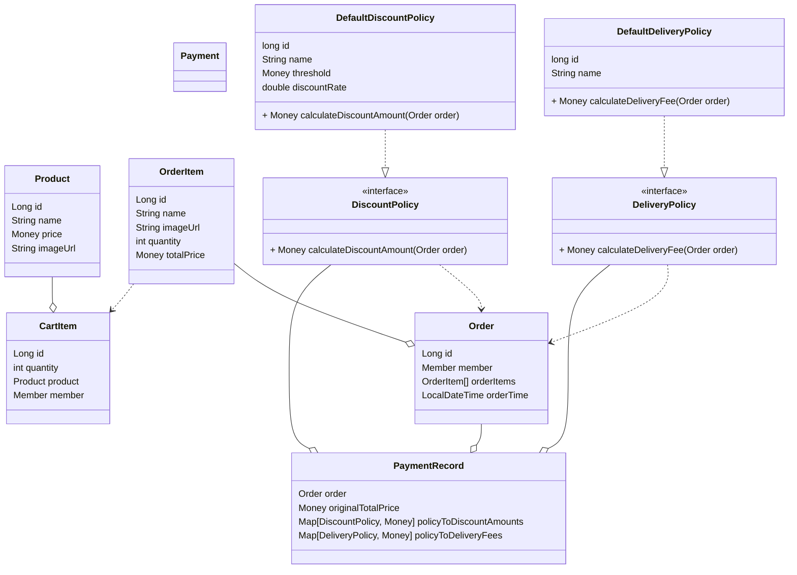

# jwp-shopping-order

# 2단계 기능 목록

- [x] Basic 인증방식이 아닐 경우 예외를 처리한다.
- [x] 상품이 존재하지 않을 경우 예외를 처리한다.
- [x] 장바구니에 상품이 존재하지 않는 경우 예외를 처리한다.
- [x] 주문할 때 인증이 되어있지 않을 경우 예외를 처리한다.
- [x] 주문 내역을 조회할 때, 주문 내역 아이디가 존재하지 않을때 예외를 처리한다.
- [x] 주문에 대한 결제 기록이 존재하지 않을 경우 예외를 처리한다.
- [x] 장바구니에서 선택한 상품들의 예상 결제 금액을 확인할 수 있다.
    - [x] member 로그인이 되지 않았을때, 가격 조회 막기
- [x] 장바구니에 담은 상품을 주문할 수 있다.
    - [x] 최소 1개 이상의 장바구니 상품을 주문할 수 있다.
    - [x] 비어있을 경우 예외처리
    - [x] 주문을 완료한 장바구니 상품은 장바구니에서 삭제된다.
    - [x] 요청한 회원의 상품이 아닐 경우 예외처리한다.
- [x] 할인 정책을 적용할 수 있다.
    - [x] 할인 정책은 기준 금액과 할인율을 가지고 있다.
    - [x] 기준 금액 이상 주문 시 전체 금액에서 할인율만큼 할인된다.
    - [x] 현재 주문에 적용 가능한 할인 정책을 찾을 수 있다.
      ex) 5만원 이상 주문 시 전체 금액에서 10% 할인이 된다.
- [x] 사용자 별로 주문 목록을 확인할 수 있다.
    - [x] 주문별로 주문번호, 상품별 정보(이름, 수량, 수량이 반영된 가격, 이미지) 를 확인할 수 있다.
- [x] 특정 주문의 상세 정보를 확인할 수 있다.
    - [x] 주문 번호, 상품별 정보와 결제 금액 정보를 확인할 수 있다.
        - [x] 결제 금액 정보는 주문 금액, 할인 금액, 배송비 정보를 포함한다.

### 시퀀스 다이어그램

- 가격 정보 조회 API

    ```mermaid
    sequenceDiagram
        autonumber
        actor A as client
        participant B as PaymentController
        participant C as PaymentService
    		participant D as Repository(도메인 별로 있지만 하나로 표현)
        A ->> B: 가격 정보 조회 API 요청
        B ->> C: 예비 주문서(DraftPaymentRecord) 생성 서비스 호출
    		C ->> D: CartItem 조회
    		C ->> C: CartItem을 OrderItem으로 변환한 후 Order 객체 생성
    		C ->> D: 전체 할인/배송비정책 조회
    		C ->> C: Order와 정책들의 정보를 종합하여 PaymentRecord 객체 생성
        C ->> B: PaymentRecord 객체 반환
    		B ->> A: PaymentRecord를 PaymentResponse로 매핑 후 반환
    ```

- 주문하기 API

    ```mermaid
    sequenceDiagram
        autonumber
        actor A as client
        participant B as OrderController
        participant C as OrderService
        participant D as PaymentService
    		participant E as Repository(도메인 별로 있지만 하나로 표현)
    		participant F as database
        A ->> B: 주문하기 API 요청
        B ->> C: Order 생성 서비스 호출
    		C ->> E: CartItem 조회 요청
    		C ->> C: CartItem을 OrderItem으로 변환한 후 Order 객체 생성
        C ->> E: Order 객체 저장 요청
        E ->> F: OrderItem, Order 엔티티 저장
    		C ->> E: CartItem 객체 삭제 요청
    		E ->> F: CartItem 엔티티 삭제
        C ->> C: 저장된 Order 엔티티의 Id를 포함한 Order 객체 생성
        B ->> D: PaymentRecord 생성 서비스 호출
    		D ->> E: 전체 할인/배송비정책 조회
    		D ->> D: Order와 정책들의 정보를 종합하여 PaymentRecord 객체 생성
        D ->> E: PaymentRecord 객체 저장
    		E ->> F: PaymentRecord, AppliedDisountPolicy, AppliedDeliveryPolicy 엔티티 저장
        B ->> A: 생성된 Order의 Id 반환
    ```

- 주문 목록 조회 API

    ```mermaid
    sequenceDiagram
        autonumber
        actor A as client
        participant B as OrderController
        participant C as OrderService
    		participant D as Repository(도메인 별로 있지만 하나로 표현)
        A ->> B: 주문 목록 조회 API 요청
        B ->> C: Order 목록 조회 서비스 호출
        C ->> D: Member가 가진 Order 리스트 조회 요청
        D ->> B: 저장된 Order 리스트 반환
        
        B ->> A: Order 리스트를 OrderResponse 리스트로 매핑 후 반환
    ```

- 주문 상세 내역 조회 API

    ```mermaid
    sequenceDiagram
        autonumber
        actor A as client
        participant B as OrderController
        participant C as OrderService
        participant D as PaymentService
    		participant E as Repository
    		participant F as database
        A ->> B: 주문 상세 내역 조회 API 요청
        B ->> C: Order 조회 서비스 호출
    		C ->> E: Order 객체 불러오기
        E ->> F: OrderItem, Order 엔티티 불러오기
        E ->> B: 저장된 Order 객체 반환
        B ->> D: PaymentRecord 조회 서비스 호출
        D ->> E: PaymentRecord 객체 불러오기
    		E ->> F: order id로 PaymentRecord, AppliedDisountPolicy, AppliedDeliveryPolicy 엔티티 불러오기
        E ->> B: 저장된 PaymentRecord 객체를 반환
        B ->> A: PaymentRecord 객체를 OrderDetailResponse로 매핑 후 반환
    ```

### 클래스 다이어그램



### DB 설계
[링크 참조](https://dbdiagram.io/d/6479c815722eb77494474a2d)

## 추후 고려사항

- 적용될 수 있는 할인 정책이 여러 개인 경우 할인율이 가장 높은 정책을 적용한다.
- 여러 배송 정책은 조건을 가지고있고, 주문이 조건을 만족하는 경우 해당 정책을 적용한다.